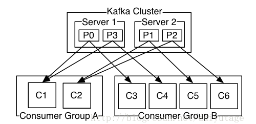

消息消费设计思路介绍
======================================================

- [消费端的重要概念](#消费端的重要概念)
  - [Consumer Group](#Consumer_Group)
  - [Consume Position](#Consume_Position)
- [Offset管理](#Offset管理)
  - [设置offset的提交方式](#设置offset的提交方式)
  - [消费端管理Offset](#消费端管理Offset)
  - [Broker管理Offset](#Broker管理Offset)


​        分析源码前，先了解一下Kafka Consumer这个Clinet的设计思路。参考的Kafka版本是2.4.1。已有大神把这个讲得很清晰了。这里引用一下[《Kafka消费组(consumer group)》](https://www.cnblogs.com/huxi2b/p/6223228.html)。

## 一. 消费端的重要概念

### 1.1 Consumer Group

​        Kafka的Group，是一种机制，用来实现<b>扩展性</b>和<b>容错性</b>。

​        Consumer Group的特性大致如下：
  * 一个Group可以拥有一个或多个 Consumer，他们共享一个Group ID。
  * 一个Group内的所有Consumer相互合作，共同消费订阅的Topic（可能是一组，多个Topic）的<b>所有分区(Partition)</b>。
  * 每个分区的消息，**只能**被Group里的 <font color=red>**一个**</font> Consumer消费。

​        这是一个 Consumer Group 的示意图：



### 1.2 Consume Position

​        通俗的讲，Consume Position表示一个Consumer已经消费了某个Topic-Partition的多少消息。Consume Position相当于一个指针，指向已经消费到 topic-partition 消息队列的某个消息的位置。Kafka针对这个位置信息提供了专门的术语：***offset***。后续文档，就使用术语 "*offset*"。

​        从<b>语义</b>上来区分，分为以下两种offset：
  * **Current Offset**：

    ​        保存在 **Consumer Group** (*client端*) ，表示Consumer希望收到的下一条信息的序号。当且仅当consumer去poll()消息时使用

  * **Committed Offset**：

    ​        保存在 **Kafka Broker** (*server端*)，由Consumer定期发送给Broker，表示Consumer已经<font color=red><b>确认</b></font>消费过的消息序号。通过consumer的 <font color=red>**commitSync()**</font>和<font color=red>**commitAsync()**</font>这 2 个 API 来完成


​        显然，Committed Offset会滞后于Current Offset。Offset 的根本作用，就是避免重复消费。使用方式不同：

  * <b>Current Offset</b>：
    * 表示 Consumer 下次消费消息的起点，每次 poll 都返回不重复的消息
    * 如果 Consumer 重启，可以继续从current offset的位置开始消费消息，避免造成重复消费
  * <b>Committed Offset</b>：
    * 如果 Consumer Group 进行了Re-balance，Topic-Partition会被分配给新的consumer。新consumer就从committed Offset位置开始消费消息，避免重复消费


## 二. Offset管理

​        这里谈及的Offset管理，是面向 ***Consumer + Broker*** 的。接下来分别介绍 Offset 在 Consumer 和 Broker 处理 Offset 的方法。

### 2.1 设置offset的提交方式

​        Kafka提供了2种方式，让 Consumer 提交 Position 给 Broker：
  * 默认采用<font color=red>**定期自动**</font>提交position
  * Kafka也为用户提供了**手动模式** (配置项：enable.auto.commit = false)

​        Kafka的Cousumer消费了消息后，并不会马上把offset信息commit到Broker，而是定期发送。通过<font color=red><b>commitSync()</b></font>和<font color=red><b>commitAsync()</b></font>这2个API来完成offset的同步。

​        所以再次强调：<b>Broker上的Committed Offset数据可能会滞后于Consumer上的Current Offset</b>。

### 2.2 消费端管理Offset

​        消费端管理Offset，可以分为以下部分：
  * Current Offset
  * Group中共享Offset
  * 与Broker同步Offset

​        Consumer对象（或者具体的实例）中，存储一个 ***SubscriptionState*** 对象。

​        ***Subscriptions*** 的定义是：A class for tracking the topics, partitions, and offsets for the consumer.

​        一个 Consumer 可能会订阅多个Topic的消息，因此，通过一个PartitionStates<TopicPartitionState>来存储不同Topic消费的Offset。<b>TopicPartitionState</b>是真正存储offset的地方，具体通过FetchPosition对象来hold住offset信息。

​        这个关系如下：

```
KafkaConsumer
   |-- SubScriptionState
          |-- PartitionStates<TopicPartitionState>
                  |-- Map<TopicPartition, TopicPartitionState>
                                              |-- FetchPosition
```

​        SubscriptionState的初始化会在KafkaConsumer创建时通过Configuration的设置创建实例，然后赋给ConsumerCoordinator实例，各个Consumer实例的SubscriptionState会被Coordintor统一管理。

​        一般的，通过一个Consumer Group来消费Broker上的数据，每个Group里会有若干个Consumer。于是，Kafka建立了一个<b>ConsumerCoordinator</b>，来统一协调Group里各个Consumer消费情况。

​        ConsumerCoordinator是这样定义的： This class manages the coordination process with the consumer coordinator。这个类的主要职责，就是 ***commit Offset*** 。


### 2.3 Broker管理Offset

​        当前版本（2.4.1），Broker提供了一个特殊的Topic来保存Offset信息。这个特殊的Topic被命名为<b>_consumer_offsets</b>。

​        __consumer_offsets中的消息保存了每个consumer group某一时刻提交的offset信息。

​        这个Topic中的Offset的信息大致入下图所示：

--------------------------------------------- </br>
｜  ｜  ｜ group-name-1|&nbsp; <- <font color=gree>*group id*</font> </br>
｜  ｜  ｜&nbsp;&nbsp;topic_test-1&nbsp;&nbsp;&nbsp;&nbsp;|&nbsp; <- <font color=gree>*topic + partition*</font> </br>
｜  ｜  ｜&nbsp;&nbsp;&nbsp;&nbsp;&nbsp;&nbsp;&nbsp;&nbsp;&nbsp;&nbsp;&nbsp;&nbsp;&nbsp;8  &nbsp;&nbsp;&nbsp;&nbsp;&nbsp;&nbsp;&nbsp;&nbsp;&nbsp;&nbsp;&nbsp;|&nbsp; <- <font color=gree>*offset value*</font> </br>
--------------------------------------------- </br>


## 三. Consumer Rebalance

### 3.1 什么是Rebalance

​        Rebalance 本质上是一种<b>协议</b>，规定了一个 Consumer Group 下的所有 Consumer 如何达成一致来分配订阅Topic的每个分区。

​        比如某个group下有20个Consumer，它订阅了一个具有100个分区的Topic。

​        正常情况下，Kafka平均会为每个Consumer分配5个分区。如果此时又增加了5个Consumer到这个Group里，那么此时每个Consumer就会分配到4个分区，这个重新分配的过程就叫Rebalance。

### 3.2 Rebalance的触发点

​        这也是经常被提及的一个问题。rebalance的触发条件有三种：

* 组成员发生变更。
  * 新Consumer加入组
  * 有Consumer主动离开组
  * 已有Consumer崩溃了
* 订阅主题数发生变更。 例如：如果你使用了正则表达式的方式进行订阅，那么新建匹配正则表达式的Topic就会触发Rebalance
* 订阅主题的分区数发生变更

### 3.3 Rebalance的策略

​        Rebalance需要一个Group下的所有Consumer都协调在一起共同参与分配。Consumer默认提供了两种分配策略：
  * Range
  * Round-Robin

​        如果默认的2种分配策略不能满足需求，用户可以创建自己的分配器以实现不同的分配策略（因为Kafka采用了可插拔式的分配策略）。

​        举个栗子：
​        假设目前某个Consumer Group下有两个Consumer： A和B。 此时又有一个成员加入，kafka会触发rebalance，并根据默认的分配策略重新为A、B和C分配分区。 示例图如下：

+-------------+ </br>
| Consumer A&nbsp; | </br>
+-------------+ </br>
|&nbsp;&nbsp;&nbsp;&nbsp;topicA-0&nbsp;&nbsp;&nbsp;&nbsp;&nbsp;| </br>
|&nbsp;&nbsp;&nbsp;&nbsp;topicB-1&nbsp;&nbsp;&nbsp;&nbsp;&nbsp;| &nbsp;&nbsp;&nbsp;&nbsp;&nbsp;&nbsp;&nbsp;&nbsp;&nbsp;&nbsp;&nbsp;&nbsp;&nbsp;+-------------+&nbsp;&nbsp;+-------------+&nbsp;&nbsp;+--------------+&nbsp;&nbsp;</br>
|&nbsp;&nbsp;&nbsp;&nbsp;topicC-0&nbsp;&nbsp;&nbsp;&nbsp;&nbsp;| &nbsp;&nbsp;&nbsp;&nbsp;&nbsp;&nbsp; &nbsp;&nbsp; &nbsp;&nbsp;&nbsp;|&nbsp;&nbsp;Consumer A&nbsp;|&nbsp;&nbsp;&nbsp;|&nbsp;&nbsp;Consumer B&nbsp;|&nbsp;&nbsp;&nbsp;|&nbsp;&nbsp;Consumer C&nbsp;|
</br>
+-------------+ &nbsp;&nbsp;&nbsp;&nbsp;&nbsp;&nbsp;&nbsp;&nbsp;&nbsp;&nbsp;&nbsp;&nbsp;+-------------+&nbsp;&nbsp;+-------------+&nbsp;&nbsp;+--------------+&nbsp;&nbsp;</br>
&nbsp;&nbsp;&nbsp;&nbsp;&nbsp;&nbsp;&nbsp;&nbsp;&nbsp;&nbsp;&nbsp;&nbsp;&nbsp;&nbsp;&nbsp;&nbsp;&nbsp;&nbsp;&nbsp;&nbsp;&nbsp;&nbsp;&nbsp;&nbsp;&nbsp;&nbsp;&nbsp;&nbsp;&nbsp;&nbsp;&nbsp;&nbsp;&nbsp;&nbsp;&nbsp;&nbsp;&nbsp;&nbsp;&nbsp;&nbsp;&nbsp;&nbsp;|&nbsp;&nbsp;TopicA-0&nbsp;&nbsp;&nbsp;&nbsp;&nbsp;|&nbsp;&nbsp;&nbsp;&nbsp;|&nbsp;&nbsp;TopicA-1&nbsp;&nbsp;&nbsp;&nbsp;&nbsp;&nbsp;&nbsp;|&nbsp;&nbsp;&nbsp;|&nbsp;&nbsp;TopicB-1&nbsp;&nbsp;&nbsp;&nbsp;&nbsp;&nbsp;&nbsp;&nbsp;|<br>
&nbsp;&nbsp;&nbsp;&nbsp;&nbsp;&nbsp;&nbsp;&nbsp;&nbsp;&nbsp;&nbsp;&nbsp;&nbsp;&nbsp;&nbsp;&nbsp;&nbsp;&nbsp;&nbsp;&nbsp;&nbsp;&nbsp;&nbsp;&nbsp;&nbsp;&nbsp;&nbsp;&nbsp;=> &nbsp;&nbsp;&nbsp;&nbsp;&nbsp;&nbsp;&nbsp;&nbsp;|&nbsp;&nbsp;TopicC-0&nbsp;&nbsp;&nbsp;&nbsp;&nbsp;|&nbsp;&nbsp;&nbsp;&nbsp;|&nbsp;&nbsp;TopicB-0&nbsp;&nbsp;&nbsp;&nbsp;&nbsp;&nbsp;|&nbsp;&nbsp;&nbsp;|&nbsp;&nbsp;TopicC-1&nbsp;&nbsp;&nbsp;&nbsp;&nbsp;&nbsp;&nbsp;&nbsp;|
<br>
&nbsp;&nbsp;&nbsp;&nbsp;&nbsp;&nbsp;&nbsp;&nbsp;&nbsp;&nbsp;&nbsp;&nbsp;&nbsp;&nbsp;&nbsp;&nbsp;&nbsp;&nbsp;&nbsp;&nbsp;&nbsp;&nbsp;&nbsp;&nbsp;&nbsp;&nbsp;&nbsp;&nbsp;&nbsp;&nbsp;&nbsp;&nbsp;&nbsp;&nbsp;&nbsp;&nbsp;&nbsp;&nbsp;&nbsp;&nbsp;&nbsp;&nbsp;+-------------+&nbsp;&nbsp;+-------------+&nbsp;&nbsp;+--------------+&nbsp;&nbsp;<br>
+-------------+ </br>
| Consumer B&nbsp; | </br>
+-------------+ </br>
|&nbsp;&nbsp;&nbsp;&nbsp;topicA-1&nbsp;&nbsp;&nbsp;&nbsp;&nbsp;| </br>
|&nbsp;&nbsp;&nbsp;&nbsp;topicB-0&nbsp;&nbsp;&nbsp;&nbsp;&nbsp;| </br>
|&nbsp;&nbsp;&nbsp;&nbsp;topicC-1&nbsp;&nbsp;&nbsp;&nbsp;&nbsp;| </br>
+-------------+ </br>

### 3.4 Rebalance的执行和Consumer Group管理

​        前面已经提到：Kafka建立了一个 <b>ConsumerCoordinator</b>，来统一协调Group里各个Consumer消费情况。

​        ConsumerCoordinator是这样定义的： This class manages the coordination process with the consumer coordinator. 这个类的主要职责，就是commit Offset。

​        Consumer Group的第一个Consumer启动的时候，它会去和kafka server确定谁是它们组的Coordinator。之后该Group内的所有成员都会和该Coordinator进行协调通信。**Coordinator不再需要zookeeper了**，性能上可以得到很大的提升。

### 3.5 Coordinator的确定

* 确定consumer group位移信息写入__consumers_offsets的哪个分区。具体计算公式：<br>
　__consumers_offsets partition# = Math.abs(groupId.hashCode() % groupMetadataTopicPartitionCount) <br>
　<font color=red>*注意：groupMetadataTopicPartitionCount由offsets.topic.num.partitions指定，默认是50个分区。*</font>
* 该分区leader所在的broker就是被选定的coordinator