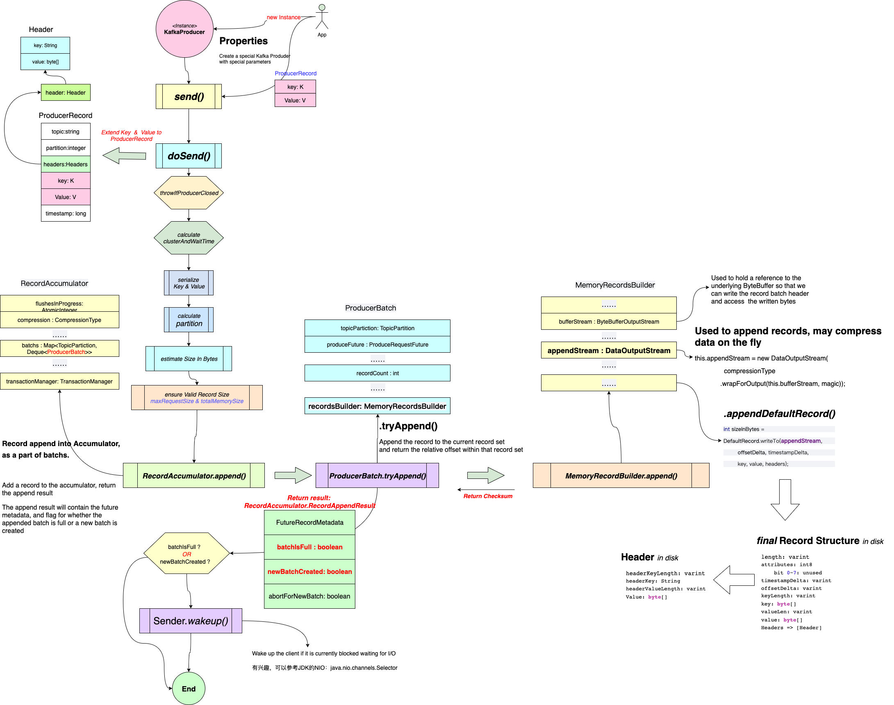

KafKa Producer发送消息的过程
=================

# 一个Producer节点发送消息的过程: <br/>
从Kafka提供的API来看，一个消息生产者发送消息还是很简单的。
这就是大家常用发送消息的代码，简单易用。这里选用“同步”发送的方式：
```java
  //==================================
  // 把消息发送到Topic是“kafka”的服务器上
  // 消息内容是： key： “Kafka_Products”
  //            value: "测试"
  //==================================
  ProducerRecord<String, String> record = new ProducerRecord<>(“Kafka”, “Kafka_Products”, “测试”);
  try{
      //========================
      // Kafka提供的接口非常简单
      //========================
      Future future = producer.send(record);
      future.get();//不关心是否发送成功，则不需要这行。
    } catch(Exception e) {
      // 处理异常
    }
```

现在，就从这个简单的入口入手，一窥究竟。幸好，Kafka的Client用Java重写了，读起来容易些：
```java
  /**
   * 所谓的“同步”调用，也是异步的。
   * 这个方法和下面的方法可以视为一个。
   * Asynchronously send a record to a topic. Equivalent to <code>send(record, null)</code>.
   * See {@link #send(ProducerRecord, Callback)} for details.
  */
  @Override
  public Future<RecordMetadata> send(ProducerRecord<K, V> record) {
    return send(record, null);
  }

  //========================================================================
  // 和上个方法没有区别。
  // 这里加入的interceptors.onSend(record)，就是给消息加些料而已。
  // 至于加什么料，可以自定义这个Interceptor。 比如，给所有要发的消息加个签名啥的。
  //
  // 核心的逻辑在doSend() 这个方法里
  //========================================================================
  @Override
  public Future<RecordMetadata> send(ProducerRecord<K, V> record, Callback callback) {
    // intercept the record, which can be potentially modified; this method does not throw exceptions
    ProducerRecord<K, V> interceptedRecord = this.interceptors.onSend(record);
    return doSend(interceptedRecord, callback);
  }
```

上硬核的菜：
```java
  /**
   * Implementation of asynchronously send a record to a topic.
   */
  private Future<RecordMetadata> doSend(ProducerRecord<K, V> record, Callback callback) {
      // 这个对象在后续处理中非常有用
      TopicPartition tp = null;
      try {
          ... 省略一些代码
          
          //====================================================
          // 为了传输效率，也为了后续的存储紧凑，都需要序列化
          //====================================================
          byte[] serializedKey;
          try {
              serializedKey = keySerializer.serialize(record.topic(), record.headers(), record.key());
          } catch (ClassCastException cce) {
            ...
          }
          byte[] serializedValue;
          try {
              serializedValue = valueSerializer.serialize(record.topic(), record.headers(), record.value());
          } catch (ClassCastException cce) {
              ...
          }
          //====================================================
          // 计算message需要发送到哪个Partition
          // 这步很重要。后续对消息的处理，都需要Topic与Partition
          //
          // 计算消息的大小，是按照序列化后byte的大小计算的。
          //====================================================
          int partition = partition(record, serializedKey, serializedValue, cluster);
          tp = new TopicPartition(record.topic(), partition);  
          setReadOnly(record.headers());
          Header[] headers = record.headers().toArray();  
          //====================================================
          // 估算当前消息的大小
          //====================================================
          int serializedSize = AbstractRecords.estimateSizeInBytesUpperBound(apiVersions.maxUsableProduceMagic(),
                  compressionType, serializedKey, serializedValue, headers);
          ensureValidRecordSize(serializedSize);
          long timestamp = record.timestamp() == null ? time.milliseconds() : record.timestamp();
          if (log.isTraceEnabled()) {
              log.trace("Attempting to append record {} with callback {} to topic {} partition {}", record, callback, record.topic(), partition);
          }
          // producer callback will make sure to call both 'callback' and interceptor callback
          Callback interceptCallback = new InterceptorCallback<>(callback, this.interceptors, tp);  
          if (transactionManager != null && transactionManager.isTransactional()) {
              transactionManager.failIfNotReadyForSend();
          }
          //====================================================
          // 关键步骤：
          //====================================================
          RecordAccumulator.RecordAppendResult result = accumulator.append(tp, timestamp, serializedKey,
                  serializedValue, headers, interceptCallback, remainingWaitMs, true);
          
          if (result.abortForNewBatch) {
              int prevPartition = partition;
              partitioner.onNewBatch(record.topic(), cluster, prevPartition);
              partition = partition(record, serializedKey, serializedValue, cluster);
              tp = new TopicPartition(record.topic(), partition);
              if (log.isTraceEnabled()) {
                  log.trace("Retrying append due to new batch creation for topic {} partition {}. The old partition was {}", record.topic(), partition, prevPartition);
              }
              // producer callback will make sure to call both 'callback' and interceptor callback
              interceptCallback = new InterceptorCallback<>(callback, this.interceptors, tp);  
              result = accumulator.append(tp, timestamp, serializedKey,
                  serializedValue, headers, interceptCallback, remainingWaitMs, false);
          }
          
          if (transactionManager != null && transactionManager.isTransactional())
              transactionManager.maybeAddPartitionToTransaction(tp);  
          if (result.batchIsFull || result.newBatchCreated) {
              log.trace("Waking up the sender since topic {} partition {} is either full or getting a new batch", record.topic(), partition);
              this.sender.wakeup();
          }
          return result.future;
          // handling exceptions and record the errors;
          // for API exceptions return them in the future,
          // for other exceptions throw directly
      } catch (ApiException e) {
          ... // 异常处理，省略
      }
      ... // 后续代码都是异常处理， 省略
  }
```


# Kafka汇总各个Producer消息的过程

# Kafka是如何把消息发送到Kafka Server