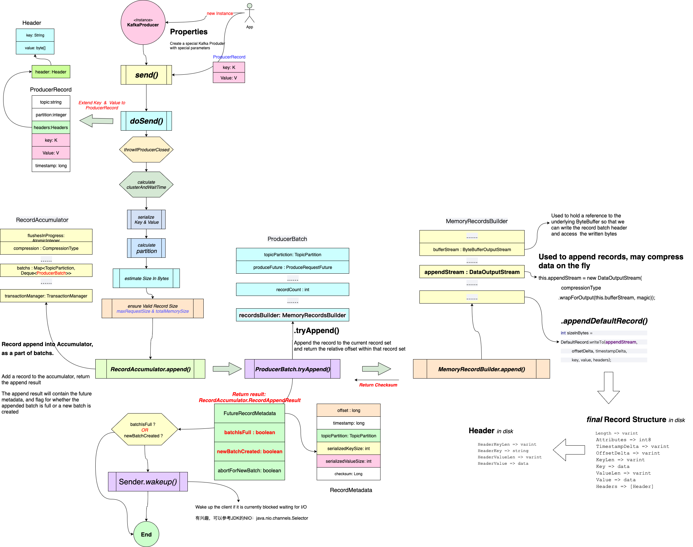

KafKa Producer发送消息的过程
=================
- [使用者角度看Producer发送消息的过程](#使用者角度看Producer发送消息的过程)
  - [Producer发送消息过程分析](#Producer发送消息过程分析)
  - [Producer发送消息流程总结](#Producer发送消息流程总结)
- [自身角度看Producer发送消息过程](#自身角度看Producer发送消息过程)
  - [KafkaProducer发送消息的模型](#KafkaProducer发送消息的模型)
- [消息网络传输过程](#消息网络传输过程)

# 使用者角度看Producer发送消息的过程<br/>
从Kafka提供的API来看，一个消息生产者发送消息还是很简单的。
这就是大家常用发送消息的代码，简单易用。这里选用“同步”发送的方式：
```java
  //==================================
  // 消息的Topic: Kafka
  // 消息内容是： key： “Kafka_Products”
  //            value: "测试"
  //==================================
  ProducerRecord<String, String> record = new ProducerRecord<>(“Kafka”, “Kafka_Products”, “测试”);
  try{
      //========================
      // Kafka提供的接口非常简单
      //========================
      Future future = producer.send(record);
      future.get();//不关心是否发送成功，则不需要这行。
    } catch(Exception e) {
      // 处理异常
    }
```

此时，消息是否开始传递给Kafka Server了呢？那就让我们窥探一下这个send()方法。

## Producer发送消息过程分析
现在，就从这个简单的入口入手，一窥究竟。幸好，Kafka的Client用Java重写了，读起来容易些：
```java
  /**
   * 所谓的“同步”调用，也是异步的。
   * 这个方法和下面的方法可以视为一个。
   * Asynchronously send a record to a topic. Equivalent to <code>send(record, null)</code>.
   * See {@link #send(ProducerRecord, Callback)} for details.
  */
  @Override
  public Future<RecordMetadata> send(ProducerRecord<K, V> record) {
    return send(record, null);
  }

  //========================================================================
  // 和上个方法没有区别。
  // 这里加入的interceptors.onSend(record)，就是给消息加些料而已。
  // 至于加什么料，可以自定义这个Interceptor。 比如，给所有要发的消息加个签名啥的。
  //
  // 核心的逻辑在doSend() 这个方法里
  //========================================================================
  @Override
  public Future<RecordMetadata> send(ProducerRecord<K, V> record, Callback callback) {
    // intercept the record, which can be potentially modified; this method does not throw exceptions
    ProducerRecord<K, V> interceptedRecord = this.interceptors.onSend(record);
    return doSend(interceptedRecord, callback);
  }
```

上硬核的菜：
```java
  /**
   * 一个消息，即使调用了该方法，也未必真的发到了kafka server
   */
  private Future<RecordMetadata> doSend(ProducerRecord<K, V> record, Callback callback) {
      // 这个对象在后续处理中非常有用
      TopicPartition tp = null;
      try {
          ... 省略一些代码
          
          //====================================================
          // 为了传输效率，也为了后续的存储紧凑，都需要序列化
          //====================================================
          byte[] serializedKey;
          try {
              serializedKey = keySerializer.serialize(record.topic(), record.headers(), record.key());
          } catch (ClassCastException cce) {
            ...
          }
          byte[] serializedValue;
          try {
              serializedValue = valueSerializer.serialize(record.topic(), record.headers(), record.value());
          } catch (ClassCastException cce) {
              ...
          }
          //====================================================
          // 计算message需要发送到哪个Partition
          // 这步很重要。后续对消息的处理，都需要Topic与Partition
          //
          // 计算消息的大小，是按照序列化后byte的大小计算的。
          //====================================================
          int partition = partition(record, serializedKey, serializedValue, cluster);
          tp = new TopicPartition(record.topic(), partition);  
          setReadOnly(record.headers());
          Header[] headers = record.headers().toArray();  
          //====================================================
          // 估算当前消息的大小
          //====================================================
          int serializedSize = AbstractRecords.estimateSizeInBytesUpperBound(apiVersions.maxUsableProduceMagic(),
                  compressionType, serializedKey, serializedValue, headers);
          ensureValidRecordSize(serializedSize);
          long timestamp = record.timestamp() == null ? time.milliseconds() : record.timestamp();
          if (log.isTraceEnabled()) {
              log.trace("Attempting to append record {} with callback {} to topic {} partition {}", record, callback, record.topic(), partition);
          }
          // producer callback will make sure to call both 'callback' and interceptor callback
          Callback interceptCallback = new InterceptorCallback<>(callback, this.interceptors, tp);  
          if (transactionManager != null && transactionManager.isTransactional()) {
              transactionManager.failIfNotReadyForSend();
          }
          //=========================================================================
          // 最核心的步骤了。
          // 此方法的含义是：把序列化后的消息发送到指定的Topic + Partition 组合中去，
          // 并且，如果当前的发送数据包（batch）已经满了，就创建新的数据包
          // 下面，我们好好研究这个RecordAccumulator的append()方法
          //=========================================================================
          RecordAccumulator.RecordAppendResult result = accumulator.append(tp, timestamp, serializedKey,
                  serializedValue, headers, interceptCallback, remainingWaitMs, true);
          
          //====================================================
          // 如果发现当前要发送数据包已经装不下这条数据了，
          // 那么就需要重新创建一个新的数据包，
          // 当然，发送到哪个partition也要重新计算一下
          //====================================================
          if (result.abortForNewBatch) {
              int prevPartition = partition;
              partitioner.onNewBatch(record.topic(), cluster, prevPartition);
              partition = partition(record, serializedKey, serializedValue, cluster);
              tp = new TopicPartition(record.topic(), partition);
              if (log.isTraceEnabled()) {
                  log.trace("Retrying append due to new batch creation for topic {} partition {}. The old partition was {}", record.topic(), partition, prevPartition);
              }
              // producer callback will make sure to call both 'callback' and interceptor callback
              interceptCallback = new InterceptorCallback<>(callback, this.interceptors, tp);
              //===============================================================================
              // 同上边对此方法的注释。 此处只是最后一个参数改为了“false”，
              // 这个参数的含义是： 
              // 创建一个新的Batch之前返回，并且在再此尝试添加到发送包之前执行partition的onNewBatch方法。
              // 此处设置为“false”，是因为刚刚创建了一个新的Batch。
              //===============================================================================
              result = accumulator.append(tp, timestamp, serializedKey,
                  serializedValue, headers, interceptCallback, remainingWaitMs, false);
          }
          
          if (transactionManager != null && transactionManager.isTransactional())
              transactionManager.maybeAddPartitionToTransaction(tp); 
          //===============================================================
          // 如果发现消息包满了（或者已经创建了新的发送包），就通知发送线程去发送消息了
          // 注意：如果创建了新的数据包，而刚刚要发的消息恰恰在这个新创建的包中，那么，
          // 马上要发送的数据是旧的数据，刚刚加入的消息则等待下次发送
          //===============================================================
          if (result.batchIsFull || result.newBatchCreated) {
              log.trace("Waking up the sender since topic {} partition {} is either full or getting a new batch", record.topic(), partition);
              //===========================================
              // 这个warkup，让我们想到什么？
              // 一定是有一个等待的线程来执行真正的发送操作              
              //===========================================
              this.sender.wakeup();
          }
          return result.future;
          // handling exceptions and record the errors;
          // for API exceptions return them in the future,
          // for other exceptions throw directly
      } catch (ApiException e) {
          ... // 异常处理，省略
      }
      ... // 后续代码都是异常处理， 省略
  }
```

RecordAccumulator.java， 顾名思义，就是收集消息的地方。 

这个对象，不仅仅是收集当前节点需要发送的消息，还需要汇总其他节点的消息。后续我们会介绍到。

```java
    public RecordAppendResult append(TopicPartition tp,
                                     long timestamp,
                                     byte[] key,
                                     byte[] value,
                                     Header[] headers,
                                     Callback callback,
                                     long maxTimeToBlock,
                                     boolean abortOnNewBatch) throws InterruptedException {
        // We keep track of the number of appending thread to make sure we do not miss batches in
        // abortIncompleteBatches().
        appendsInProgress.incrementAndGet();
        ByteBuffer buffer = null;
        if (headers == null) headers = Record.EMPTY_HEADERS;
        try {
            // check if we have an in-progress batch
            Deque<ProducerBatch> dq = getOrCreateDeque(tp);
            synchronized (dq) {
                if (closed)
                    throw new KafkaException("Producer closed while send in progress");
                
                //================================================
                // 如果已经有一个正在等待消息的数据包，那就尝试追加到该包上
                // 如果追加成功，就返回结果。                
                //================================================
                RecordAppendResult appendResult = tryAppend(timestamp, key, value, headers, callback, dq);
                if (appendResult != null)
                    return appendResult;
            }

            // 这个是调用发法前设置的逻辑。 
            if (abortOnNewBatch) {
                // Return a result that will cause another call to append.
                return new RecordAppendResult(null, false, false, true);
            }
            
            //====================================================
            // 如果当前没有正在等待接收消息的数据包，那就试图创建一个新的
            //====================================================
            byte maxUsableMagic = apiVersions.maxUsableProduceMagic();
            int size = Math.max(this.batchSize, AbstractRecords.estimateSizeInBytesUpperBound(maxUsableMagic, compression, key, value, headers));
            log.trace("Allocating a new {} byte message buffer for topic {} partition {}", size, tp.topic(), tp.partition());
            buffer = free.allocate(size, maxTimeToBlock);
            synchronized (dq) {
                // Need to check if producer is closed again after grabbing the dequeue lock.
                if (closed)
                    throw new KafkaException("Producer closed while send in progress");

                RecordAppendResult appendResult = tryAppend(timestamp, key, value, headers, callback, dq);
                if (appendResult != null) {
                    // Somebody else found us a batch, return the one we waited for! Hopefully this doesn't happen often...
                    return appendResult;
                }

                MemoryRecordsBuilder recordsBuilder = recordsBuilder(buffer, maxUsableMagic);
                ProducerBatch batch = new ProducerBatch(tp, recordsBuilder, time.milliseconds());
                FutureRecordMetadata future = Objects.requireNonNull(batch.tryAppend(timestamp, key, value, headers,
                        callback, time.milliseconds()));

                dq.addLast(batch);
                incomplete.add(batch);

                // Don't deallocate this buffer in the finally block as it's being used in the record batch
                buffer = null;
                return new RecordAppendResult(future, dq.size() > 1 || batch.isFull(), true, false);
            }
        } finally {
            if (buffer != null)
                free.deallocate(buffer);
            appendsInProgress.decrementAndGet();
        }
    }
```

业务逻辑是上面代码表达了。真正把数据添加到发送数据包的，则是这个方法：
```java
    private RecordAppendResult tryAppend(long timestamp, byte[] key, byte[] value, Header[] headers,
                                         Callback callback, Deque<ProducerBatch> deque) {
        ProducerBatch last = deque.peekLast();
        if (last != null) {
            FutureRecordMetadata future = last.tryAppend(timestamp, key, value, headers, callback, time.milliseconds());
            if (future == null)
                last.closeForRecordAppends();
            else
                return new RecordAppendResult(future, deque.size() > 1 || last.isFull(), false, false);
        }
        return null;
    }
```

很简单，直接看ProducerBatch的tryAppend():

```java
    public FutureRecordMetadata tryAppend(long timestamp, byte[] key, byte[] value, Header[] headers, Callback callback, long now) {
        if (!recordsBuilder.hasRoomFor(timestamp, key, value, headers)) {
            return null;
        } else {
            //===============================================================
            // 通过一个Builder类来完成
            //===============================================================
            Long checksum = this.recordsBuilder.append(timestamp, key, value, headers);
            this.maxRecordSize = Math.max(this.maxRecordSize, AbstractRecords.estimateSizeInBytesUpperBound(magic(),
                    recordsBuilder.compressionType(), key, value, headers));
            this.lastAppendTime = now;
            FutureRecordMetadata future = new FutureRecordMetadata(this.produceFuture, this.recordCount,
                                                                   timestamp, checksum,
                                                                   key == null ? -1 : key.length,
                                                                   value == null ? -1 : value.length,
                                                                   Time.SYSTEM);
            // we have to keep every future returned to the users in case the batch needs to be
            // split to several new batches and resent.
            thunks.add(new Thunk(callback, future));
            this.recordCount++;
            return future;
        }
    }
```

MemoryRecordsBuilder.java的append最后调用的方法：
```java
    /**
     * Append a record and return its checksum for message format v0 and v1, or null for v2 and above.
     */
    private Long appendWithOffset(long offset, boolean isControlRecord, long timestamp, ByteBuffer key,
                                  ByteBuffer value, Header[] headers) {
        try {
            // 省略一些check代码
            ....

            // 根据版本决定使用哪个格式的Record
            if (magic > RecordBatch.MAGIC_VALUE_V1) {
                appendDefaultRecord(offset, timestamp, key, value, headers);
                return null;
            } else {
                return appendLegacyRecord(offset, timestamp, key, value, magic);
            }
        } catch (IOException e) {
            throw new KafkaException("I/O exception when writing to the append stream, closing", e);
        }
    }
```

一般的，这里只研究最新的代码。只看appendDefaultRecord()。 
```java
    
    private void appendDefaultRecord(long offset, long timestamp, ByteBuffer key, ByteBuffer value,
                                     Header[] headers) throws IOException {
        ensureOpenForRecordAppend();
        int offsetDelta = (int) (offset - baseOffset);
        long timestampDelta = timestamp - firstTimestamp;
        //==============================================================
        // 第一个参数很关键。 查看了MemoryRecordsBuilder，是这样定义的：
        //     Used to append records, may compress data on the fly
        //     private DataOutputStream appendStream
        // 消息最终就会写到这个stream里
        //==============================================================
        int sizeInBytes = DefaultRecord.writeTo(appendStream, offsetDelta, timestampDelta, key, value, headers);
        recordWritten(offset, timestamp, sizeInBytes);
    }
```

最后，深入writeTo()，看看数据是如何写到Stream里的：
```java
    //==============================================================
    // out： Used to append records, may compress data on the fly
    //==============================================================
    public static int writeTo(DataOutputStream out,
                              int offsetDelta,
                              long timestampDelta,
                              ByteBuffer key,
                              ByteBuffer value,
                              Header[] headers) throws IOException {
        int sizeInBytes = sizeOfBodyInBytes(offsetDelta, timestampDelta, key, value, headers);
        ByteUtils.writeVarint(sizeInBytes, out);

        byte attributes = 0; // there are no used record attributes at the moment
        out.write(attributes);

        ByteUtils.writeVarlong(timestampDelta, out);
        ByteUtils.writeVarint(offsetDelta, out);

        if (key == null) {
            ByteUtils.writeVarint(-1, out);
        } else {
            int keySize = key.remaining();
            ByteUtils.writeVarint(keySize, out);
            //==============================================
            // 把序列化后的key写到Stream里
            //==============================================
            Utils.writeTo(out, key, keySize);
        }

        if (value == null) {
            ByteUtils.writeVarint(-1, out);
        } else {
            int valueSize = value.remaining();
            ByteUtils.writeVarint(valueSize, out);
            //==============================================
            // 把序列化后的value写到Stream里
            //==============================================
            Utils.writeTo(out, value, valueSize);
        }

        if (headers == null)
            throw new IllegalArgumentException("Headers cannot be null");

        ByteUtils.writeVarint(headers.length, out);

        //==============================================
        // 把message的头信息写到Stream里
        //==============================================        
        for (Header header : headers) {
            String headerKey = header.key();
            if (headerKey == null)
                throw new IllegalArgumentException("Invalid null header key found in headers");

            byte[] utf8Bytes = Utils.utf8(headerKey);
            ByteUtils.writeVarint(utf8Bytes.length, out);
            out.write(utf8Bytes);

            byte[] headerValue = header.value();
            if (headerValue == null) {
                ByteUtils.writeVarint(-1, out);
            } else {
                ByteUtils.writeVarint(headerValue.length, out);
                out.write(headerValue);
            }
        }

        return ByteUtils.sizeOfVarint(sizeInBytes) + sizeInBytes;
    }
```

## Producer发送消息流程总结
上述的过程，可以总结成如下的图，直观的描述了Producer发送消息的过程：



# 自身角度看Producer发送消息过程

通过上面的分析，已经了解，当Kafka通过KafkaProducer的send()方法把消息交给Kafka后，消息并没有及时的被传输给Server。而是通过一些列的操作，被放到一个数据包中，等待数据包满了以后，再“唤醒”一个叫做Sender的家伙（一个Thread对象）。

看到wakeup的时候，我们就基本上有个思路：应该是一个独立的线程来处理发送消息的任务。这样看来，一个KafkaProducer本身，就实现了一个类似“生产者-消费者”的模型。

是不是如此，我们继续往下看。

这个Sender是什么呢？源码中的定义：

 > <P>The <b>background thread</b> that handles the sending of produce requests to the Kafka cluster. <br/>This thread makes metadata requests to renew its view of the cluster and then sends produce requests to the appropriate nodes.
 </p>

显然，这是一个守候线程，等到收集到足够的数据，就发送数据。那么，重要逻辑应该就在这个线程对象的run()方法里：
```java
    /**
     * The main run loop for the sender thread
     */
    public void run() {
        log.debug("Starting Kafka producer I/O thread.");

        // main loop, runs until close is called
        while (running) {
            try {
                //===============================
                // 这里调用了sendProducerData()
                //===============================
                runOnce();
            } catch (Exception e) {
                log.error("Uncaught error in kafka producer I/O thread: ", e);
            }
        }

        //=====================================================================
        // 省略很多代码，主要是处理这个的问题：
        // 如果线程被停止，可能RecordAccumulator中还有数据没有发送出去，要让线程优雅地停止
        // 自行看代码吧
        //=====================================================================
        ...        
    }

    /**
     * Run a single iteration of sending
     *
     */
    void runOnce() {
        ...
        //===============================
        // 发送消息，调用获取response的方法
        //===============================
        long pollTimeout = sendProducerData(currentTimeMs);
        client.poll(pollTimeout, currentTimeMs);   
    }

```

具体处理方式：
```java
    private long sendProducerData(long now) {
        //===============================
        // 获取Broker的集群环境
        // 例如获取Leader
        //===============================
        Cluster cluster = metadata.fetch();        
        
        //==============================================================
        // 把要发送的消息，根据Topic-Partition进行分类，然后再设置每个Topic在集群中的
        // leader节点信息，作为发送的目的地
        //
        // 如果此时某个Topic对应的集群没有了Leader节点，即将发送的数据会被收集到
        // 一个叫做unknownLeaderTopics的集合里，这些消息也不会从batch中删除
        //==============================================================
        RecordAccumulator.ReadyCheckResult result = this.accumulator.ready(cluster, now);

        // 省略一些check代码
        ...

        //===============================================
        // 通过NetworkClient（this.client）对象过滤无效节点
        // 下一步整理消息时，会根据节点来归类
        //===============================================
        Iterator<Node> iter = result.readyNodes.iterator();
        long notReadyTimeout = Long.MAX_VALUE;
        while (iter.hasNext()) {
            Node node = iter.next();
            //=============================
            // 测试一下服务器对应节点是否联通
            //=============================
            if (!this.client.ready(node, now)) {
                iter.remove();
                notReadyTimeout = Math.min(notReadyTimeout, this.client.pollDelayMs(node, now));
            }
        }

        //==========================================================
        // 创建发送的请求对象
        //-------------------------------
        // 这一步很关键，用的词（drain）也很形象：
        // 筛选出混存在accumulator中的消息，可以向哪些节点发送。
        // 并且为每个节点（Node）创建按每个节点适合指定大小的消息批列表。
        // 
        // 注意：这里只针对已经可以接收消息的节点进行处理。
        //==========================================================
        Map<Integer, List<ProducerBatch>> batches = this.accumulator.drain(cluster, result.readyNodes, this.maxRequestSize, now);
        addToInflightBatches(batches);
        if (guaranteeMessageOrder) {
            // Mute all the partitions drained
            for (List<ProducerBatch> batchList : batches.values()) {
                for (ProducerBatch batch : batchList)
                    this.accumulator.mutePartition(batch.topicPartition);
            }
        }

        //=================================================
        // 本批次要发送的数据准备好后，就设置下批次发送的时间
        //=================================================
        accumulator.resetNextBatchExpiryTime();
        //=================================================
        // 把本批次还未发送，但是已经超时的消息过滤出来
        //=================================================
        List<ProducerBatch> expiredInflightBatches = getExpiredInflightBatches(now);
        List<ProducerBatch> expiredBatches = this.accumulator.expiredBatches(now);
        expiredBatches.addAll(expiredInflightBatches);

        // 这里省略对过期消息的处理。有兴趣的自己可以看看
        ...

        // 省略一些计算发送这些消息等待Broker的Response时长
        ...

        //======================================================
        // 发送数据
        // 根据前面消息的整理，每个Node会创建一个Request
        //======================================================
        sendProduceRequests(batches, now);

        // 这个pollTimeout，是接收Response的时间
        return pollTimeout;
    }
```

这里的sendProduceRequests()又有很多次方法调用，这里不在贴代码。直接定位到最后，是JDK的I/O把数据发送出去。

# KafkaProducer发送消息的模型

到这里，就可以把KafkaProducer发送消息的模型直观的画出来了。


## Sender唤醒过程

这个唤醒过程挺有意思。通过代码的追踪，通过调用sender线程的wakeup()，其实是Sender去唤醒NetworkClient（这里不是线程了，是通知客户端开始服务了），这个client会去唤醒Selector。 来看看代码：

主线程：
```java
    if (result.batchIsFull || result.newBatchCreated) {        
        this.sender.wakeup();
    }
```

然后是Sender.java
```java
    /**
     * Wake up the selector associated with this send thread
     */
    public void wakeup() {
        this.client.wakeup();
    }
```

接下来是NetworkClient.java
```java
    /**
     * Interrupt the client if it is blocked waiting on I/O.
     */
    @Override
    public void wakeup() {
        this.selector.wakeup();
    }
```

然后就是NIO的Selector.java了：
```java
    /**
     * Interrupt the nioSelector if it is blocked waiting to do I/O.
     */
    @Override
    public void wakeup() {
        this.nioSelector.wakeup();
    }
```
极有可能有线程在select等待事件被阻塞了，通过wakeup唤醒那个线程开始工作.

# 消息网络传输过程
这里涉及到Java的NIO。 了解NIO前，先看看发送的代码。 NIO使用Channel作为通道发送数据。 Kafka创建了KafkaChanne对象：

```java
    //==================================================
    // 这里的Send真实对象，是Kafka自定义的NetworkSend
    //==================================================
    public void setSend(Send send) {
        if (this.send != null)
            throw new IllegalStateException("Attempt to begin a send operation with prior send operation still in progress, connection id is " + id);
        this.send = send;
        // 采用Zero-Copy
        this.transportLayer.addInterestOps(SelectionKey.OP_WRITE);
    }

    //实例化一个Send对象
    public Send toSend(String destination, RequestHeader header) {
        return new NetworkSend(destination, serialize(header));
    }
```