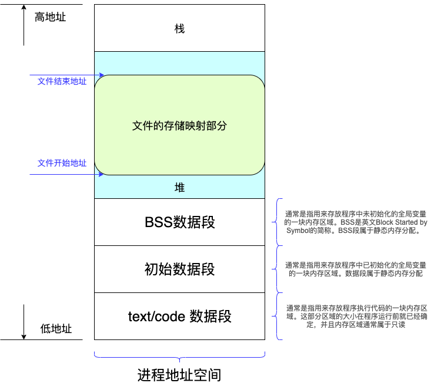

# Kafka持久化消息
Kafka对消息的处理，提供了多种方式。

这里关注的是Kafka如何把消息持久化到存储介质上。Kafka提供了一个重要的对象，作为消息在内存与存储介质之间的桥梁

## org.apache.kafka.common.record.FileRecords
这个类的官方解释：

A Records implementation backed by a file. An optional start and end position can be applied to this instance to enable slicing a range of the log records.

<pre>
  <code>
  public class FileRecords extends AbstractRecords implements Closeable {    
    private final boolean isSlice;
    private final int start;
    private final int end;

    // 
    private final Iterable<FileLogInputStream.FileChannelRecordBatch> batches;

    // mutable state
    private final AtomicInteger size;

    // 把Message写入到文件的通道。这个是核心对象
    private final FileChannel channel;

    // 文件句柄
    private volatile File file;

    //============================
    //此处省略n行代码
    //============================
    ..............
    //============================

    //============================
    // 核心代码
    //============================
    /**
     * Append a set of records to the file. This method is not thread-safe and must be
     * protected with a lock.
     *
     * @param records The records to append
     * @return the number of bytes written to the underlying file
     */
    public int append(MemoryRecords records) throws IOException {
        if (records.sizeInBytes() > Integer.MAX_VALUE - size.get())
            throw new IllegalArgumentException(
                      "Append of size " + records.sizeInBytes() 
                    + " bytes is too large for segment with current file position at " 
                    + size.get());
        //===================================
        //最为关键的一行，把数据写到channel (FileChannel)
        //FileChannel会负责把数据持久化到文件中
        //===================================
        int written = records.writeFullyTo(channel);

        size.getAndAdd(written);
        return written;
    }

    /**
     * Commit all written data to the physical disk
     */
    public void flush() throws IOException {
        channel.force(true);
    }
  }
  </code>
</pre>

现在来看看writeFullyTo()是如何做的。 

这个方法归属于MemoreyRecords(*MemoryRecords.java*)对象（*面向对象的基本概念，没有委托给XXXService处理*）:

<pre>
  <code>
  /**
     * Write all records to the given channel (including partial records).
     * @param channel The channel to write to
     * @return The number of bytes written
     * @throws IOException For any IO errors writing to the channel
     */
    public int writeFullyTo(GatheringByteChannel channel) throws IOException {
        buffer.mark();
        int written = 0;
        while (written < sizeInBytes())
            //===================================
            // 这里最核心了。涉及到了OS（研究对象是Linux）的内核态了
            //===================================
            written += channel.write(buffer);
        buffer.reset();
        return written;
    }
  </code>
</pre>

这个时候，就要深入的了解一下Channel如何实现write(ByteBuffer src)的。 

在深入看Channel的实现类之前，我们就需要补习一些Linux是如何高效地把数据写入到存储介质里的了。

## OS内核的文件操作
研究的操作系统选用Linux；CPU以Intel的X86为主。以下的分析就以这两者为例。

如果遇到Unix，BSD系统，RISC的CPU（如ARM、SPARC），可以自行搜集相关信息。

### CPU
一般的，CPU将指令分成了2大类：特权指令 + 非特权指令。

Intel的CPU又将特权级别分成了4个级别，级别从高到低，分别是：
* RING0  (级别最高)
* RING1 
* RING2 
* RING3 (级别最低)

*<big>一般来说，级别低的指令不能访问高级别指令使用的地址空间</big>*

### Linux用户空间 VS 内核空间

* 用户空间: 指的就是用户可以操作和访问的空间，这个空间通常存放我们用户自己写的数据等
* 内核空间: 是系统内核来操作的一块空间，这块空间里面存放系统内核的函数、接口等

* 用户态: 在用户空间下执行，此时运行程序的这种状态成为用户态
* 内核态: 当程序执行在内核的空间执行时，这种状态称为内核态

Linux使用了CPU的2个特权级别，分别执行“用户态”和“内核态”的指令。
* 用户态: RING3
* 内核态: Ring0

*Linux没有使用RING1和RING2*

用户的程序运行在RING3，并且不能访问RING0的地址空间；操作系统运行在Ring0，并提供系统调用，供用户态的程序使用。

如果用户态的程序的某一个操作需要内核态来协助完成(*例如读取磁盘上的一段数据*)，那么用户态的程序就会通过系统调用来调用内核态的接口，请求操作系统来完成某种操作。

### I/O缓冲区
#### 概念
在I/O过程中，读取磁盘的速度相对内存读取速度要慢的多。因此为了能够加快处理数据的速度，需要将读取过的数据缓存在内存里。而这些缓存在内存里的数据就是高速缓冲区（buffer cache），下面简称为“buffer”。

具体来说，buffer（缓冲区）是一个用于存储速度不同步的设备或优先级不同的设备之间传输数据的区域。一方面，通过缓冲区，可以使进程之间的相互等待变少，从而使从速度慢的设备读入数据时，速度快的设备的操作进程不发生间断。另一方面，可以保护硬盘或减少网络传输的次数。

#### Buffer和Cache
buffer和cache是两个不同的概念：cache是高速缓存，用于CPU和内存之间的缓冲；buffer是I/O缓存，用于内存和硬盘的缓冲；简单的说，cache是加速“读”，而buffer是缓冲“写”，前者解决读的问题，保存从磁盘上读出的数据，后者是解决写的问题，保存即将要写入到磁盘上的数据。

*Cache示意图*

#### Buffer Cache和 Page Cache
buffer cache和page cache都是为了处理设备和内存交互时高速访问的问题。buffer cache可称为块缓冲器，page cache可称为页缓冲器。在linux不支持虚拟内存机制之前，还没有页的概念，因此缓冲区以块为单位对设备进行访问。在linux采用虚拟内存的机制来管理内存后，页是虚拟内存管理的最小单位，开始采用页缓冲的机制来缓冲内存。

Linux2.6之后内核将这两个缓存整合，页和块可以相互映射，同时，页缓存page cache面向的是虚拟内存，块I/O缓存Buffer cache是面向块设备。<b>需要强调的是，页缓存和块缓存对进程来说就是一个存储系统，进程不需要关注底层的设备的读写</b>。

buffer cache和page cache两者最大的区别是缓存的粒度。buffer cache面向的是文件系统的块。而内核的内存管理组件采用了比文件系统的块更高级别的抽象：页page，其处理的性能更高。因此和内存管理交互的缓存组件，都使用页缓存。

*Cache与Buffer的映射关系*

### JDK中的MMAP

这里研究的是FileChannelImpl这个实现类:
<pre>
  <code>
    public int write(ByteBuffer src) throws IOException {
        ensureOpen();
        if (!writable)
            throw new NonWritableChannelException();
        synchronized (positionLock) {
            if (direct)
                //===================================
                //
                //===================================
                Util.checkChannelPositionAligned(position(), alignment);
            int n = 0;
            int ti = -1;
            try {
                beginBlocking();
                ti = threads.add();
                if (!isOpen())
                    return 0;
                do {
                    //===================================
                    //
                    //===================================
                    n = IOUtil.write(fd, src, -1, direct, alignment, nd);
                } while ((n == IOStatus.INTERRUPTED) && isOpen());
                return IOStatus.normalize(n);
            } finally {
                threads.remove(ti);
                endBlocking(n > 0);
                assert IOStatus.check(n);
            }
        }
    }
  </code>
</pre>