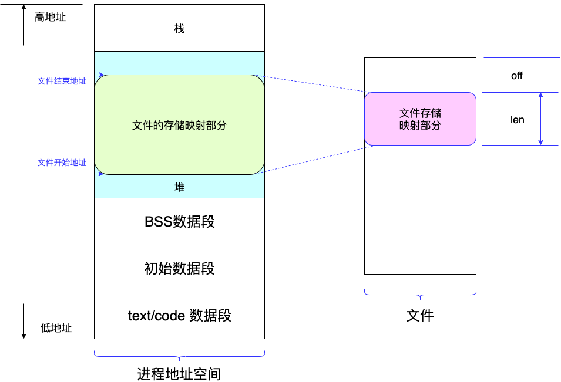

Kafka持久化消息
=================
- [探索Kafka消息的存储关系](#探索Kafak消息的存储关系)
- [存储消息](#存储消息)
  - [org.apache.kafka.common.record.FileRecords](#orgapachekafkacommonrecordfilerecords)
  - [OS内核的文件操作](#os内核的文件操作)
    - [CPU](#cpu)
    - [Linux用户空间 VS 内核空间](#linux用户空间-vs-内核空间)
    - [I/O缓冲区](#io缓冲区)
    - [概念](#概念)
      - [Buffer和Cache](#buffer和cache)
      - [Buffer Cache和 Page Cache](#buffer-cache和-page-cache)
      - [Page Cache](#page-cache)
      - [Address Space](#address-space)
    - [文件读写基本流程](#文件读写基本流程)
      - [读文件](#读文件)
      - [写文件](#写文件)
  - [JDK中的Channel](#jdk中的channel)
- [存储消息索引](#存储消息索引)
  - [mmap是什么](#mmap是什么)

---

Kafka Server存储消息，不仅仅是消息本身，另一个重要的是消息的索引文件。

接下来会针对这两种数据的持久化分别做说明。

# 探索Kafak消息的存储关系
Kafka提供了很多概念，用于存储具体的消息。大家熟知的有：

  - Topic
  - Partition
  - Log
  - LogSegment
  - MessageSet (aka Records, there are several implements)
  - Message (aka Record)

官方也提供了对Topic这个概念的一个高度抽象的示意图: 


根据源码，把逻辑上的概念与真实的物理文件关系上了。下图展示了逻辑概念与具体文件的关系:


具体的File，就与MessageSet（aka Records，具体实现就是FileRecoreds）紧密关联。所有的消息，都会<b>追加</b>到对应的File上。

下面，就来分析这些FileRecordds是如何追加到File中的，速度是如此之快！

# 存储消息

Kafka对消息的封装是对象:

org.apache.kafka.common.record.Record (默认实现是: *DefaultRecord*)。

这个Record的结构如下(已经在“消息生产”部分介绍过了)：

```
 Record =>
    Length => Varint
    Attributes => Int8
    TimestampDelta => Varlong
    OffsetDelta => Varint
    Key => Bytes
    Value => Bytes
    Headers => [HeaderKey HeaderValue]
      HeaderKey => String
      HeaderValue => Bytes
```
但是，Kafka Server不会单独记录一条消息到介质上，而是会汇集了一批记录后再持久化到存储介质上。Kafka Server通过如下对(FileRecords)象来持久化消息的：

## org.apache.kafka.common.record.FileRecords
这个类的官方解释：

A Records implementation backed by a file. An optional start and end position can be applied to this instance to enable slicing a range of the log records.

现在，只关注此对象的“写”操作。通过阅读官方文档，Kafka持久化消息时，采用的是顺序读写的方式，所有的数据是“追加”到现有文件（Partition）的后面。因此，核心方法也是这里的“append”方法：

```java
  public class FileRecords extends AbstractRecords implements Closeable {    
    private final boolean isSlice;
    private final int start;
    private final int end;

    // 
    private final Iterable<FileLogInputStream.FileChannelRecordBatch> batches;

    // mutable state
    private final AtomicInteger size;

    // 把Message写入到文件的通道。这个是核心对象
    private final FileChannel channel;

    // 文件句柄
    private volatile File file;

    //此处省略n行代码    
    ..............

    //============================
    // 核心代码
    //============================
    /**
     * Append a set of records to the file. This method is not thread-safe and must be
     * protected with a lock.
     * 这个方法，就是把记录（Message）写到文件里
     *
     * @param records The records to append
     * @return the number of bytes written to the underlying file
     */
    public int append(MemoryRecords records) throws IOException {
        if (records.sizeInBytes() > Integer.MAX_VALUE - size.get())
            throw new IllegalArgumentException(
                      "Append of size " + records.sizeInBytes() 
                    + " bytes is too large for segment with current file position at " 
                    + size.get());
        //===================================
        //最为关键的一行，把数据写到channel (FileChannel)
        //FileChannel会负责把数据持久化到文件中
        //===================================
        int written = records.writeFullyTo(channel);

        size.getAndAdd(written);
        return written;
    }

    /**
     * Commit all written data to the physical disk
     */
    public void flush() throws IOException {
        channel.force(true);
    }

    /**
     * Attempts to write the contents of this buffer to a channel.
     * 接口中的描述：试图把缓存中的内容写到一个通道中。
     *
     * 这个方法，用于把数据发送其他节点、消费者
     */
    @Override
    public long writeTo(GatheringByteChannel destChannel, long offset, int length) throws IOException {
        long newSize = Math.min(channel.size(), end) - start;
        int oldSize = sizeInBytes();
        if (newSize < oldSize)
            throw new KafkaException(String.format(
                    "Size of FileRecords %s has been truncated during write: old size %d, new size %d",
                    file.getAbsolutePath(), oldSize, newSize));

        long position = start + offset;
        int count = Math.min(length, oldSize);
        final long bytesTransferred;
        if (destChannel instanceof TransportLayer) {
            TransportLayer tl = (TransportLayer) destChannel;
            bytesTransferred = tl.transferFrom(channel, position, count);
        } else {
            //============================================================
            // 调用NIO，零拷贝方式：磁盘 -> 内核空间  - >目的缓冲区
            //============================================================
            bytesTransferred = channel.transferTo(position, count, destChannel);
        }
        return bytesTransferred;
    }
  }
```

现在来看看writeFullyTo()是如何做的。 

这个方法归属于MemoreyRecords(*MemoryRecords.java*)对象（*面向对象的基本概念，没有委托给XXXService处理*）:

```java
  /**
     * Write all records to the given channel (including partial records).
     * @param channel The channel to write to
     * @return The number of bytes written
     * @throws IOException For any IO errors writing to the channel
     */
    public int writeFullyTo(GatheringByteChannel channel) throws IOException {
        buffer.mark();
        int written = 0;
        while (written < sizeInBytes())
            //===================================
            // 这里最核心了。涉及到了OS（研究对象是Linux）的内核态了
            //===================================
            written += channel.write(buffer);
        buffer.reset();
        return written;
    }
```

这个时候，就要深入的了解一下Channel如何实现write(ByteBuffer src)的。 

在深入看Channel的实现类之前，我们就需要补习一些Linux是如何高效地把数据写入到存储介质里的了。

## OS内核的文件操作
研究的操作系统选用Linux；CPU以Intel的X86为主。以下的分析就以这两者为例。

如果遇到Unix，BSD系统，RISC的CPU（如ARM、SPARC），可以自行搜集相关信息。

### CPU
一般的，CPU将指令分成了2大类：特权指令 + 非特权指令。

Intel的CPU又将特权级别分成了4个级别，级别从高到低，分别是：
* RING0  (级别最高)
* RING1 
* RING2 
* RING3 (级别最低)

*<big>一般来说，级别低的指令不能访问高级别指令使用的地址空间</big>*

### Linux用户空间 VS 内核空间

* 用户空间: 指的就是用户可以操作和访问的空间，这个空间通常存放我们用户自己写的数据等
* 内核空间: 是系统内核来操作的一块空间，这块空间里面存放系统内核的函数、接口等

* 用户态: 在用户空间下执行，此时运行程序的这种状态成为用户态
* 内核态: 当程序执行在内核的空间执行时，这种状态称为内核态

Linux使用了CPU的2个特权级别，分别执行“用户态”和“内核态”的指令。
* 用户态: RING3
* 内核态: Ring0

*Linux没有使用RING1和RING2*

用户的程序运行在RING3，并且不能访问RING0的地址空间；操作系统运行在Ring0，并提供系统调用，供用户态的程序使用。

如果用户态的程序的某一个操作需要内核态来协助完成(*例如读取磁盘上的一段数据*)，那么用户态的程序就会通过系统调用来调用内核态的接口，请求操作系统来完成某种操作。<b>此时，用户空间的数据，需要COPY一份到内核空间。</b>换句话说，所有的I/O操作，都是在内核态完成。

### I/O缓冲区
#### 概念
在I/O过程中，读取磁盘的速度相对内存读取速度要慢的多。因此为了能够加快处理数据的速度，需要将读取过的数据缓存在内存里。而这些缓存在内存里的数据就是高速缓冲区（buffer cache），下面简称为“buffer”。

具体来说，buffer（缓冲区）是一个用于存储速度不同步的设备或优先级不同的设备之间传输数据的区域。一方面，通过缓冲区，可以使进程之间的相互等待变少，从而使从速度慢的设备读入数据时，速度快的设备的操作进程不发生间断。另一方面，可以保护硬盘或减少网络传输的次数。

#### Buffer和Cache
buffer和cache是两个不同的概念：cache是高速缓存，用于CPU和内存之间的缓冲；buffer是I/O缓存，用于内存和硬盘的缓冲；简单的说，cache是加速“读”，而buffer是缓冲“写”，前者解决读的问题，保存从磁盘上读出的数据，后者是解决写的问题，保存即将要写入到磁盘上的数据。


#### Buffer Cache和 Page Cache
buffer cache和page cache都是为了处理设备和内存交互时高速访问的问题。buffer cache可称为块缓冲器，page cache可称为页缓冲器。在linux不支持虚拟内存机制之前，还没有页的概念，因此缓冲区以块为单位对设备进行访问。在linux采用虚拟内存的机制来管理内存后，页是虚拟内存管理的最小单位，开始采用页缓冲的机制来缓冲内存。

Linux2.6之后内核将这两个缓存整合，页和块可以相互映射，同时，页缓存page cache面向的是虚拟内存，块I/O缓存Buffer cache是面向块设备。<b>需要强调的是，页缓存和块缓存对进程来说就是一个存储系统，进程不需要关注底层的设备的读写</b>。

buffer cache和page cache两者最大的区别是缓存的粒度。buffer cache面向的是文件系统的块。而内核的内存管理组件采用了比文件系统的块更高级别的抽象：页page，其处理的性能更高。因此和内存管理交互的缓存组件，都使用页缓存。


### Page Cache
页缓存是面向文件，面向内存的。<b>通俗来说，它位于内存和文件之间缓冲区，文件I/O操作实际上只和Page Cache交互，不直接和内存交互。</b>Page Cache可以用在所有以文件为单元的场景下，比如网络文件系统等等。Page Cache通过一系列的数据结构，比如inode, address_space, struct page，实现将一个文件映射到页的级别：

1. struct page结构标志一个物理内存页，通过page + offset就可以将此页帧定位到一个文件中的具体位置。同时struct page还有以下重要参数：
  - 标志位flags来记录该页是否是脏页，是否正在被写回等等；
  - mapping指向了地址空间address_space，表示这个页是一个页缓存中页，和一个文件的地址空间对应；
  - index记录这个页在文件中的页偏移量；

2. 文件系统的inode实际维护了这个文件所有的块block的块号，通过对文件偏移量offset取模可以很快定位到这个偏移量所在的文件系统的块号，磁盘的扇区号。同样，通过对文件偏移量offset进行取模可以计算出偏移量所在的页的偏移量。

3. page cache缓存组件抽象了地址空间address_space这个概念来作为文件系统和页缓存的中间桥梁。地址空间address_space通过指针可以方便的获取文件inode和struct page的信息，所以可以很方便地定位到一个文件的offset在各个组件中的位置，即通过：文件字节偏移量 --> 页偏移量 --> 文件系统块号 block  -->  磁盘扇区号

4. 页缓存实际上就是采用了一个基数树结构将一个文件的内容组织起来存放在物理内存struct page中。一个文件inode对应一个地址空间address_space。而一个address_space对应一个页缓存基数树。

这里是一个Page Cache形成的示意图：


<font color=red>*Linux系统中，每个“页”的大小是4K，后面展示的代码中有标注*</font>

### Address Space
Address_Space是Linux内核中的一个关键抽象，它被作为文件系统和页缓存的中间适配器，用来指示一个文件在页缓存中已经缓存了的物理页。因此，它是页缓存和外部设备中文件系统的桥梁。如果将文件系统可以理解成数据源，那么address_space可以说关联了内存系统和文件系统。

那么页缓存是如何通过address_space实现缓冲区功能的？我们再来看完整的文件读写流程。

### 文件读写基本流程
#### 读文件

1. 进程调用库函数向内核发起读文件请求
2. 内核通过检查进程的文件描述符定位到虚拟文件系统的已打开文件列表表项
3. 调用该文件可用的系统调用函数read()
4. read()函数通过文件表项链接到目录项模块，根据传入的文件路径，在目录项模块中检索，找到该文件的inode
5. 在inode中，通过文件内容偏移量计算出要读取的页
6. 通过inode找到文件对应的address_space
7. 在address_space中访问该文件的页缓存树，查找对应的页缓存结点
    - 如果页缓存命中，那么直接返回文件内容
    - 如果页缓存缺失，那么产生一个页缺失异常，创建一个页缓存页，同时通过inode找到文件该页的磁盘地址，读取相应的页填充该缓存页；重新进行第6步查找页缓存
8. 文件内容读取成功。

#### 写文件
前5步和读文件一致，在address_space中查询对应页的页缓存是否存在。

6. 如果页缓存命中，直接把文件内容修改更新在页缓存的页中。<b>写文件就结束了。</b>这时候文件修改位于页缓存，并没有写回到磁盘文件中去。
7. 如果页缓存缺失，那么产生一个页缺失异常，创建一个页缓存页，同时通过inode找到文件该页的磁盘地址，读取相应的页填充该缓存页。此时缓存页命中，进行第6步。
8. 一个页缓存中的页如果被修改，那么会被标记成脏页。脏页需要写回到磁盘中的文件块。有两种方式可以把脏页写回磁盘：
    - 手动调用sync()或者fsync()系统调用把脏页写回
    - pdflush进程会定时把脏页写回到磁盘
  
同时注意，脏页不能被置换出内存，如果脏页正在被写回，那么会被设置写回标记，这时候该页就被上锁，其他写请求被阻塞直到锁释放。

### JDK中的Channel

MemoryRecords使用的channle是接口<b>GatheringByteChannel</b>。官方的说明是：

    A channel that can write bytes from a sequence of buffers.

这里研究的是FileChannelImpl这个实现类:
```java
    public int write(ByteBuffer src) throws IOException {
        ensureOpen();
        if (!writable)
            throw new NonWritableChannelException();
        synchronized (positionLock) {
            if (direct)
                //========================================================
                // alignment: IO alignment value for DirectIO
                // 对于Linux 2.4.10+ ，BlockSize大小： 4096(Byte) = 4KB
                // 需要与Page Cache页面对齐：
                // 用于传递数据的缓冲区，其内存边界必须对齐为 BlockSize 的整数倍
                // 用于传递数据的缓冲区，其传递数据的大小必须是 BlockSize 的整数倍。
                // 数据传输的开始点，即文件和设备的偏移量，必须是 BlockSize 的整数倍
                // 
                // 回顾一下： Producer中，设定batch.size的默认值是16384(Byte)，
                // 16384 % 4096 = 4
                // 而Linux的Page Cache正好是由4个Block组成
                //=========================================================
                Util.checkChannelPositionAligned(position(), alignment);
            int n = 0;
            int ti = -1;
            try {
                beginBlocking();
                ti = threads.add();
                if (!isOpen())
                    return 0;
                do {
                    //==========================================================
                    // 数据写入
                    // fd: FileDescriptor 是文件描述符，用来表示开放文件、开放套接字等
                    //     相当于文件句柄
                    // nd: FileDispatcher 用于不同的平台调用native()方法来完成read和write操作。
                    //==========================================================
                    n = IOUtil.write(fd, src, -1, direct, alignment, nd);
                } while ((n == IOStatus.INTERRUPTED) && isOpen());
                return IOStatus.normalize(n);
            } finally {
                threads.remove(ti);
                endBlocking(n > 0);
                assert IOStatus.check(n);
            }
        }
    }
```

IOUtil.java 中的 write():
```java
    static int write(FileDescriptor fd, ByteBuffer src, long position,
                     boolean directIO, int alignment, NativeDispatcher nd)
        throws IOException
    {
        //==========================================
        // 是否使用的是DirectBuffer
        // 如果是，则直接写
        // 否则，Kafka帮忙对齐Page Cache，然后再写
        //==========================================
        if (src instanceof DirectBuffer) {
            return writeFromNativeBuffer(fd, src, position, directIO, alignment, nd);
        }

        // Substitute a native buffer
        int pos = src.position();
        int lim = src.limit();
        assert (pos <= lim);
        int rem = (pos <= lim ? lim - pos : 0);
        ByteBuffer bb;
        //==========================================
        // 这里，Kafka帮忙对齐Page Cache，
        // 而且，都是返回DirectBuffer的实例
        //==========================================
        if (directIO) {
            Util.checkRemainingBufferSizeAligned(rem, alignment);
            bb = Util.getTemporaryAlignedDirectBuffer(rem, alignment);
        } else {
            bb = Util.getTemporaryDirectBuffer(rem);
        }
        try {
            bb.put(src);
            bb.flip();
            // Do not update src until we see how many bytes were written
            src.position(pos);

            int n = writeFromNativeBuffer(fd, bb, position, directIO, alignment, nd);
            if (n > 0) {
                // now update src
                src.position(pos + n);
            }
            return n;
        } finally {
            Util.offerFirstTemporaryDirectBuffer(bb);
        }
    }
```

IOUtil.java 中的 writeFromNativeBuffer():
```java
    private static int writeFromNativeBuffer(FileDescriptor fd, ByteBuffer bb,
                                             long position, boolean directIO,
                                             int alignment, NativeDispatcher nd)
        throws IOException
    {
        int pos = bb.position();
        int lim = bb.limit();
        assert (pos <= lim);
        int rem = (pos <= lim ? lim - pos : 0);

        if (directIO) {
            Util.checkBufferPositionAligned(bb, pos, alignment);
            Util.checkRemainingBufferSizeAligned(rem, alignment);
        }

        int written = 0;
        if (rem == 0)
            return 0;
        //==============================================
        // 真正执行“写”的地方。
        // 使用nd的pwrite()方法。此时，数据真正的算是“落盘”了
        //==============================================
        if (position != -1) {
            written = nd.pwrite(fd,
                                ((DirectBuffer)bb).address() + pos,
                                rem, position);
        } else {
            written = nd.write(fd, ((DirectBuffer)bb).address() + pos, rem);
        }
        if (written > 0)
            bb.position(pos + written);
        return written;
    }
```

上面代码的nd（NativeDispatcher），使用的实现类便是FileDispatcherImpl.java，其pwrite():
``` java

    // 就是简单的调用了native方法
    int pwrite(FileDescriptor fd, long address, int len, long position)
        throws IOException
    {
        return pwrite0(fd, address, len, position);
    }

    // 这就是native方法
    static native int pwrite0(FileDescriptor fd, long address, int len,
                             long position) throws IOException;


```

此时，从JDK的Java源码已经到头了，是到了看看FileDispatcherImpl的Native实现的时候了。 这里找来了OpenJDK的源码。通过OpenJDK源码来看看最终是如何调用OS来完成“落盘”的。

源码链接：[FileDispatcherImpl.c](https://github.com/openjdk/jdk/blob/1691abc7478bb83bd213b325007f14da4d038651/src/java.base/unix/native/libnio/ch/FileDispatcherImpl.c)

``` c
    #define pwrite64 pwrite  # 感兴趣的，可以阅读Linux的源码 pwrite() 方法

    JNIEXPORT jint JNICALL
     Java_sun_nio_ch_FileDispatcherImpl_pwrite0(JNIEnv *env, jclass clazz, jobject fdo,
                            jlong address, jint len, jlong offset)
    {
        jint fd = fdval(env, fdo);
        void *buf = (void *)jlong_to_ptr(address);

        return convertReturnVal(env, pwrite64(fd, buf, len, offset), JNI_FALSE);
    }

```
到这里，我们针对Kafka Server如何持久化消息的全部过程就了解了。

那么，对于消费者，Kafak Server有义务为它们提供快速检索消息的服务。那么，如何能快速地定位一条消息呢？Kafka Server为每个消息建立了相应的索引，并针对索引文件的存储提供了特殊的方法。接下来看看Kafka是如何做的呢？

## 存储消息索引
索引，就是为了快速查找到相应的消息记录，因此，索引文件需要常驻内存，并能及时的更新索引的数据，因为随时都有新的消息追加到服务器中。同时，这个索引文件需要随时存储到介质上，以防丢失。例如，服务器宕机后，Kafka Server能够重新装载索引文件，继续服务。

如何保证索引文件能够及时的被更新，并及时的持久化到存储介质上呢？Kafka又一次利用了JDK7后提供的新特性：

<b>mmap</b>

### mmap是什么
mmap，它是一种内存映射文件的方法，即将一个文件或者其它对象映射到进程的地址空间，实现文件磁盘地址和进程虚拟地址空间中一段虚拟地址的一一对映关系。

实现这样的映射关系后，进程就可以采用指针的方式读写操作这一段内存，而系统会自动回写脏页面到对应的文件磁盘上，即完成了对文件的操作而不必再调用read,write等系统调用函数。相反，内核空间对这段区域的修改也直接反映用户空间，从而可以实现不同进程间的文件共享。

下图是一个示意图，表达了“地址空间”与“文件”的关系：


### 消息的索引文件创建

```scala
  @volatile
  protected var mmap: MappedByteBuffer = {
    // 创建一个文件，用于存储消息的索引  
    val newlyCreated = file.createNewFile()
    val raf = if (writable) new RandomAccessFile(file, "rw") else new RandomAccessFile(file, "r")
    try {
      /* pre-allocate the file if necessary */
      if(newlyCreated) {
        if(maxIndexSize < entrySize)
          throw new IllegalArgumentException("Invalid max index size: " + maxIndexSize)
        raf.setLength(roundDownToExactMultiple(maxIndexSize, entrySize))
      }
    
      //=================================
      // 核心代码 - 把文件映射到内存
      /* memory-map the file */
      //=================================
      _length = raf.length()
      val idx = {
        if (writable)
          raf.getChannel.map(FileChannel.MapMode.READ_WRITE, 0, _length)
        else
          raf.getChannel.map(FileChannel.MapMode.READ_ONLY, 0, _length)
      }
      //=================================
      // 如果是新建的索引，设置头指针位置
      /* set the position in the index for the next entry */
      //=================================
      if(newlyCreated)
        idx.position(0)
      else
        //==============================================================
        // 如果是已经存在的索引文件，获取最有一个日志实体的位置作为当前的索引位置
        // if this is a pre-existing index, 
        // assume it is valid and set position to last entry
        //==============================================================
        idx.position(roundDownToExactMultiple(idx.limit(), entrySize))
      idx
    } finally {
      CoreUtils.swallow(raf.close(), AbstractIndex)
    }
  }
```