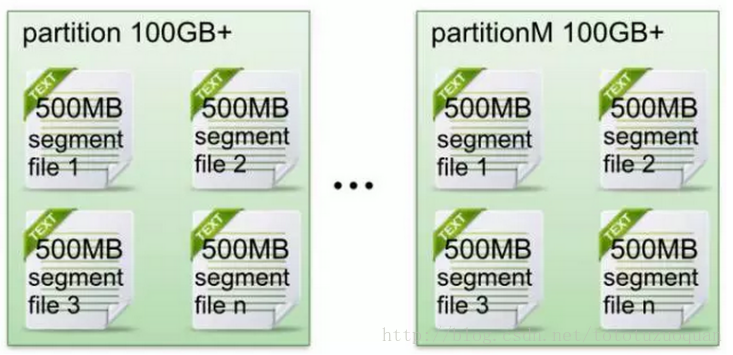
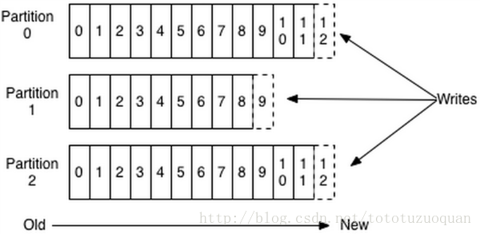
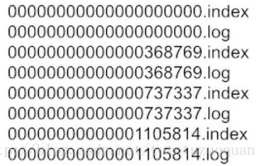
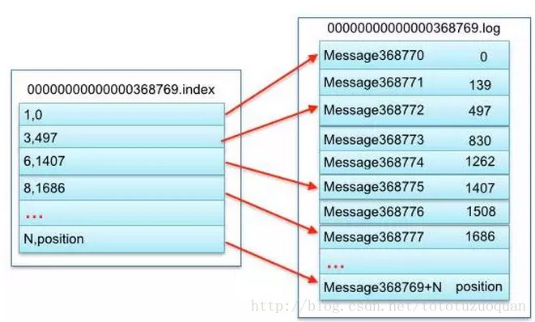

# kafka文件存储机制

原文：https://blog.csdn.net/jdtugfcg/article/details/84063357

这篇文章不是原创。源自上一行链接。

## 一. Kafka 文件存储基本结构

​        在 Kafka 文件存储中，同一个 topic 下有多个不同 partition，每个 partition 为一个目录。partition 命名规则为：***topic名称 + 有序序号***，第一个 partition 序号从 0 开始，序号最大值为 partition 数量减 1。

​        每个 partition（目录）相当于一个巨型文件被平均分配到了多个大小相等 segment（段）数据文件中。但每个段 segment 文件的消息数量不一定相等，这种特性方便 old segment 文件快速被删除。默认保留 7 天的数据。

​        每个 partition 只需要支持顺序读写就行了，segment 文件生命周期由服务端配置参数决定（什么时候创建、什么时候删除）。

​        下图是数据写入的逻辑方式：

​        现在来讨论一下数据的顺序性。

* 一个 partition里的数据是**间隔性有序**，不是连续
* 针对一个 topic 的数据，只能做到 partition 内部的间隔性有序，不能做到全局有序
* 如果一定要保证连续有序性，一个topic只能只有一个 partition

## 二. Kafka Partition Segment

* **Segment 文件组成**

  ​        segment 文件由 2 大部分组成：index 文件 + data 文件。这两个文件**一一对应**，成对出现，后缀分别是 "***.index***" 和 "***.log***"。下图是一个示意图：

  

* **Segment 文件命名规则**

  ​        partition 全局的第一个 segment 从 0 开始，后续每个 segment 文件名为**上一个** segment 文件**最后一条消息的 offset 值**。数值最大为 64位 long的大小，19位数字字符长度，没有数字用0填充。如上图所示。

* 索引文件存储大量元数据，数据文件存储大量消息，索引文件中元数据指向对应数据文件中的 message 的**物理偏移地址**。如下图所示：

  

  ​        示例图中左边框里的 $(3,497)$，表示 log 文件中的第几条信息，以及存放在磁盘上的物理偏移地址。（*注：这图有错误，当前示例的segment文件应该是 0000000000000000000.log 和 0000000000000000000.index* ）

  ​        上图中索引文件存储大量元数据，数据文件存储大量消息，索引文件中元数据指向对应数据文件中的 message 的物理偏移地址。

  ​        其中，以索引文件中元数据 $(3,497)$ 为例，依次在数据文件中表示第 3 个 message （在全局 partition 表示第 368772 个 message）、以及该消息的物理偏移量地址为 497。

* segment data文件由许多 message 组成，其物理结构如下表所示：

  | 关 键 字            | 解释说明                                                     |
  | ------------------- | :----------------------------------------------------------- |
  | 8 byte offset       | 在 partition 内的每条消息都有一个有序的 id 号，这个 id 号被称为偏移（offset），它可以唯一确定每条消息在 partition 内的位置。即 offset 表示 partition的第几个 message |
  | 4 byte message size | message 大小                                                 |
  | 4 byte CRC32        | 用 CRC32 校验 message                                        |
  | 1 byte "magic"      | 表示本次发布 Kafka 服务程序协议版本号                        |
  | 1 byte "attributes" | 表示独立版本、或者标识压缩类型、或者编码类型                 |
  | 4 byte key length   | 表示 key 的长度，当 key 为 -1 时，K byte key 字段不填        |
  | K byte key          | 可选 （有值，则存储 key 的值）                               |
  | value kytes payload | 表示消息的实际数据                                           |

  

## 三. kafka 查找 Message

​        读取 offset = 368776 的 message，需要通过下面***两个***步骤查找。引用上图例子：

### 3.1 查找 segment file

​        根据 segment文件(index文件、log文件)的命名规则，可以得到这些结论：

* 00000000000000000000.index 表示最开始的文件，起始偏移量为 $0$

* 00000000000000368769.index 的消息起始偏移量为 $368770 = 368769 + 1$

* 00000000000000737337.index 的消息起始偏移量为 $737338 = 737337 + 1$

依次类推……

​        以起始偏移量命名并排序这些文件，只要根据 ***offset***，然后采用**二分查找**发查询文件列表，就可以快速定位到具体的文件。当 $offset = 368776$ 时能迅速定位到 00000000000000368769.index 和 00000000000000368769.log文件。

### 3.2 通过 segment file 查找 message

​        当 $offset = 368776$ 时，依次定位到 00000000000000368769.index 的元数据物理位置和 00000000000000368769.log文件的物理偏移地址，然后在通过 00000000000000368769.log文件 顺序查找直到 $offset = 368776$ 为止。

