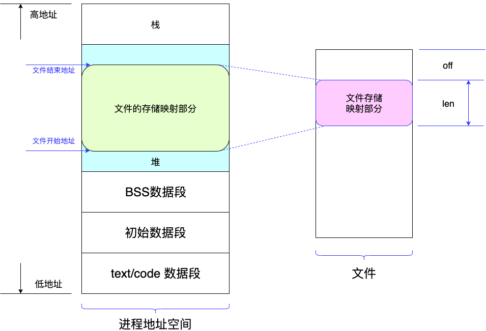

Java NIO
=======================
- [用户空间与内核空看](#用户空间vs内核空间)
- [Cache](#Cache)
  - [Buffer Cache](#Buffer-Cache)
  - [Page Cache](#Page-Cache)
  - [BufferCache与PageCache之间的关系](#BufferCache与PageCache之间的关系)
  - [MMAP](#MMAP)
- [NIO简介](#NIO介绍)
  - [I/O多路复用](I/O多路复用)
  - [零拷贝](#零拷贝)

# 用户空间vs内核空间

从字面意思理解，就是：用户空间运行普通的应用程序；内核空间运行OS内核模块。

通常，OS会提供一些系统调用函数给应用程序，便于应用程序操作系统资源。比如：应用程序需要写数据到磁盘上，OS就会提供相应的Read和Write函数。

把“应用程序调用系统的函数”的操作称为“系统调用”。如果发生了“系统调用”，操作系统就会把应用程序当时的状态保存起来（应用程序中断），然后系统内核执行继续执行被调用的函数。

这个过程中，发生了一些变化：一个应用从“用户状态”进入了“内核状态”。这个过程叫做“上下午切换”。
“用户状态”简称“用户态”，“内核状态”简称“内核态”。

# Cache
Cache大家还是蛮熟悉的。现代操作系统也大量使用了各种Cache。通常，耳熟能详的主要有这两个：Buffer_cache和Page_cache。

## Buffer Cache
数据的读/写，是一个扇区一个扇区的读/写的，但从操作系统角度，是通过一个“Block（块）”的概念来组织数据读/写的。

Buffer cache就是“Block（块）”的缓冲器，是<b>对物理磁盘的缓冲（真正物理存储的最小单位是扇区）。对于现在的硬盘，Buffer Cache大小一般是4K大小。</b>
有了Buffer Cache，应用程序多次读取磁盘上同一块的数据时，就会减少磁盘的寻址时间，也减少数据COPY时间，提高访问速度。

CentOS7的Block Size:

对Buffer Cache的<b>写</b>操作分为2种。通常，对于Cache内数据的写方式都是这两种：
  * 直接写(Write Through)：程序把数据写到Buffer Cache后，OS直接写入磁盘
  * 后台写(Write Behind)： 程序把数据写到Buffer Cache后，OS通过一些策略延后把数据写入磁盘

显然，<b>Buffer Cache是介于操作系统与硬件之间的一层缓冲，是真实的物理内存分配。</b>对于常用的Linux系统而言，会将空闲的内存全部分给Buffer Cache；如果有新的应用程序启动需要内存，Linux会自动减少Cache，释放出内存给应用程序使用。

## Page Cache
Page Cache，简称“页”，是<b>面向文件</b>，介于<b>内存和文件之间</b>，是内存与文件之间的一座桥梁。<b>是一种“逻辑”上的缓存。</b>

一个“Page Cache(页)”通常由若干“Block Cache”组成，这些“block”不一定是物理上连续的空间。

<b>应用程序进行的文件I/O操作，实际上只和Page Cache交互，不直接和内存交互，更不会和硬盘或者存储介质交互。</b>

就像Block Cache是磁盘读/写的最小单位一样，Page Cache(页)是文件组织的一个最小单位。

注：*32位的Linux系统中，每个“页”的大小是4K；64位的Linux的“页”大小是8K。*

## BufferCache与PageCache之间的关系
使用一个简单的图表示它们之间的关系：
              -------
Page Cache -->| 内存 |<-- Buffer Cache <-> 硬盘块
              -------
可见，“页”是由几个映射到内存中的Buffer Cache组成的，而且这几个Buffer Cache<b>不必是连续的物理硬盘块</b>，通过“内存”实现逻辑上的“页”。

### 文件读写逻辑
文件读写逻辑描述的方向： 数据源 --> 数据使用方:
  * 读文件：磁盘上的几个块（极可能不连续）--> Buffer Cache --> (内存) --> Page Cache --> 应用程序
  * 写文件: 应用程序 --> Page Cache --> (内存) --> Buffer Cache --> 磁盘上的块(极可能不连续)

## MMAP
mmap（Memory Mapping）是一种内存映射文件的方法，即将一个文件或者其它对象映射到进程的地址空间，实现文件磁盘地址和进程虚拟地址空间中一段虚拟地址的一一对映关系。

实现这样的映射关系后，进程就可以采用指针的方式读写操作这一段内存，而系统会自动回写脏页面到对应的文件磁盘上，即完成了对文件的操作而不必再调用read,write等系统调用函数。
相反，内核空间对这段区域的修改也直接反映用户空间，从而可以实现不同进程间的文件共享。

下图是一个示意图，表达了“地址空间”与“文件”的关系：

# NIO介绍
Java的I/O操作，如果不是写长连接的应用，基本上不会涉及。而且I/O操作往往涉及到操作系统，所以深入了解的机会就更少了。这里也不做特别深入的介绍。

基本上，I/O操作有这么几种模式：
  * 阻塞I/O
  * 非阻塞I/O
  * I/O 多路复用
  * 信号驱动I/O
  * 异步I/O

JDK大概从1.4版本开始引入NIO（非阻塞I/O）,也叫做New I/O；从1.7版本开始，引入了异步I/O(AIO, Asyncrnous I/O)。

一般的，从1.7版本开始，提到NIO，基本上是包含了AIO的特性。

Kafka使用的NIO，也是充分利用了AIO特性的。

## I/O多路复用
I/O Multiplexing，俗称I/O多路复用技术，或者叫做Event Drien I/O，就是我们常说的Selector/Epoll。好处就是单个process（进程）就可以<b>同时处理</b>多个网络连接。它的基本原理就是Selector/Epoll这个function会不断轮训所负责的所有Socket连接，当某个Socket有数据到达，就通知用户进程。

这里需要简单介绍下Selector/Epoll 的基本概念。

先来介绍下Select方法：

每个Socket会被加入到一个进程中（一个进程会监控多个Socket对象，一般默认是1024个）。如果这个进程监控的所有Socket都没有接收到数据，该进程就会被阻塞。
如果某个Socket接收到了数据（数据已经写入内核态内存），就会给CPU发送中断指令，把该Socket所在的进程唤醒（进入工作队列）。然后OS就会遍历进程中所有的Socket对象，把有数据的Socket挑选出来，然后执行下一步的操作。

这样做的方式不够高效，需要遍历整个列表。

Epoll: 

Epoll创建一个Event Poll队列，这个队列分为2部分：等待队列 + 就绪队列。所有等待的Socket都添加到这个队列的等待队列中。如果某个Socket有数据来了，Event Poll就会把该Socket移到“就绪”队列中。

有了Event Poll队列，OS中断操作的对象不再是进程，而是这个Event Poll队列。而且Epoll对于“就绪”队列，采用“双向链表”，来实现快速“删除”、“添加”的操作。可以精准的定位到哪个Socket有数据，而无需再遍历整个Socket列表了。操作复杂度由原来的O(n)降低为O(1)。

PS: 详细介绍参考： https://blog.csdn.net/armlinuxww/article/details/92803381

## 零拷贝